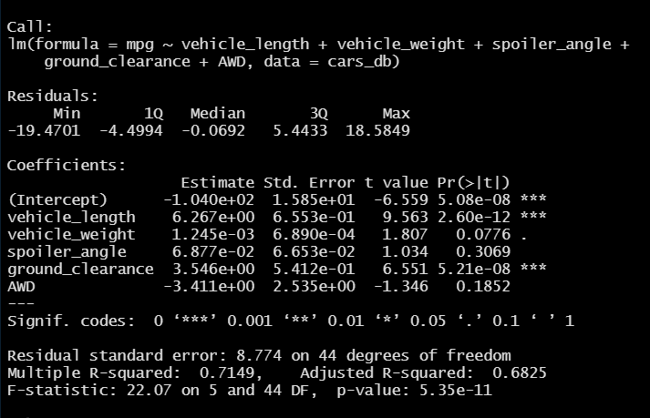
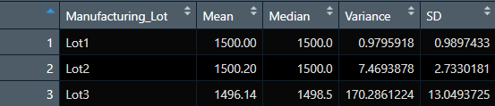
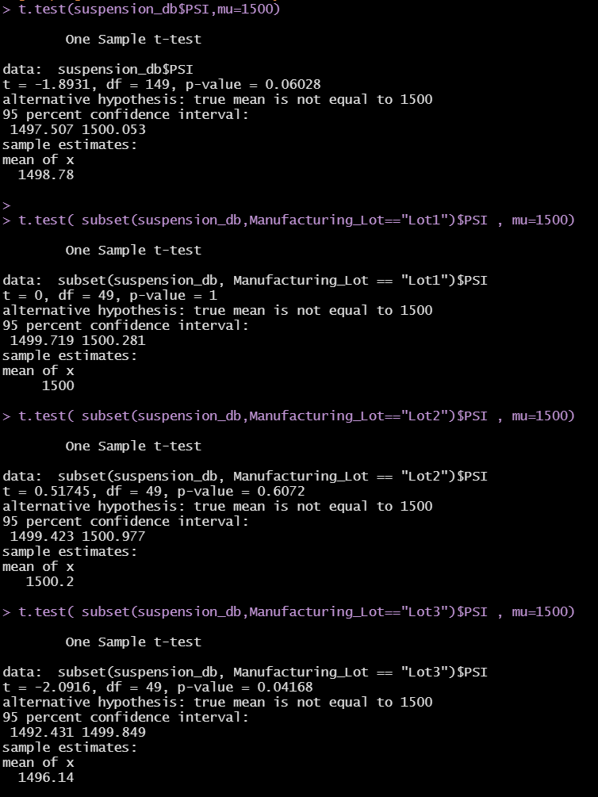

# MechaCar_Statistical_Analysis
Data Analytics Boot Camp Challenge 15

## Linear Regression to Predict MPG

As per the summary results above, we can confidently state the following:

- Intercept, vehicle length, and ground clearance provided a non-random amount of variance to the mpg values in the dataset
- The slope of the linear model is not considered to be zero because we have a very low p-value (much lower the `5%`) and a high r-squared value: `0.71`
- This linear model does predict mpg of MechaCar prototypes effectively. The reason is that our Intercept is not statistically significant which could mean that our independent variables explain a significant amount of variability of our dependant variable

## Summary Statistics on Suspension Coils

Based on the above summary tables, we can state the following:

- The variance of the suspension coils meets specifications and does not exceed `100` pounds per square inch for all manufacturing lots
- The variance of the suspension coils meets specifications and does not exceed `100` pounds per square inch for *Lot 1* and *Lot 2*
- The variance of the suspension coils does not meet specifications and exceeds `100` pounds per square inch for *Lot 3*

## T-Tests on Suspension Coils

Based on the above t-tests results, we can interpret the following:
- *Lot 1* has a **p-value** of `1`. We can safely state we don't have enough evidence to reject the Null hypothesis 
- *Lot 2* has a **p-value** of `1`. We can safely state we don't have enough evidence to reject the Null hypothesis 
- *Lot 3* has a **p-value** < `5%` which suggests that there is enough evidence that we can reject the null hypothesis for the entire population

## Study Design: MechaCar vs Competition

I would create a few statistical tests to compare ***MechaCar*** against other market competitors. Key metrics I think would be of great importance to the consumer are:
    1. MPG
    2. Average Safety Rating
    3. Average maintenance Cost
    4. Selling Price
- The Null hypothesis would be that ***MechaCar*** performance in all `4` metrics would be the same as the competitor. The alternative hypothesis would be that MechaCar performance in some or all metrics would be different with a significance level of `5%`
- Since I want to compare each metric of ***MechaCar*** against the same metric of the competitor and since the metrics are continuous numerical data, I will use the **one-sample t-test**
- I will need sample data for ***MechaCar*** and the competitor which includes metrics for MPG, average safety ratings, average maintenance cost, and selling price

---

